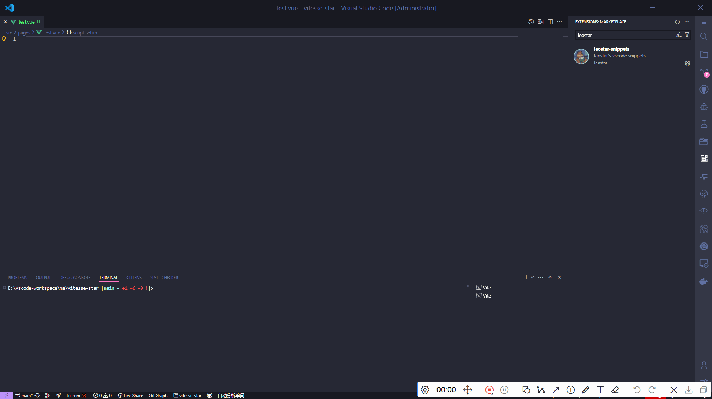

# vscode-leostar-snippets

leostar's vscode snippets🎞

## Install

[👉leostar-snippets](https://marketplace.visualstudio.com/items?itemName=leostar-tools.leostar-snippets)

## Snippets

- [x] vue3
- [x] react
- [x] javascript
- [x] typescript
- [x] css reset
- [x] nestjs
- [x] pinia
- [x] vitest
- [x] jest
- [x] regex

## LICENSE

MIT
